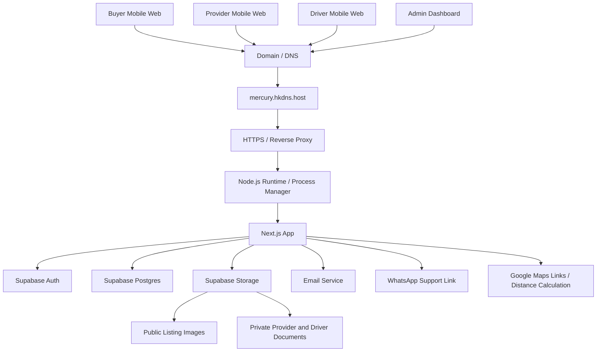
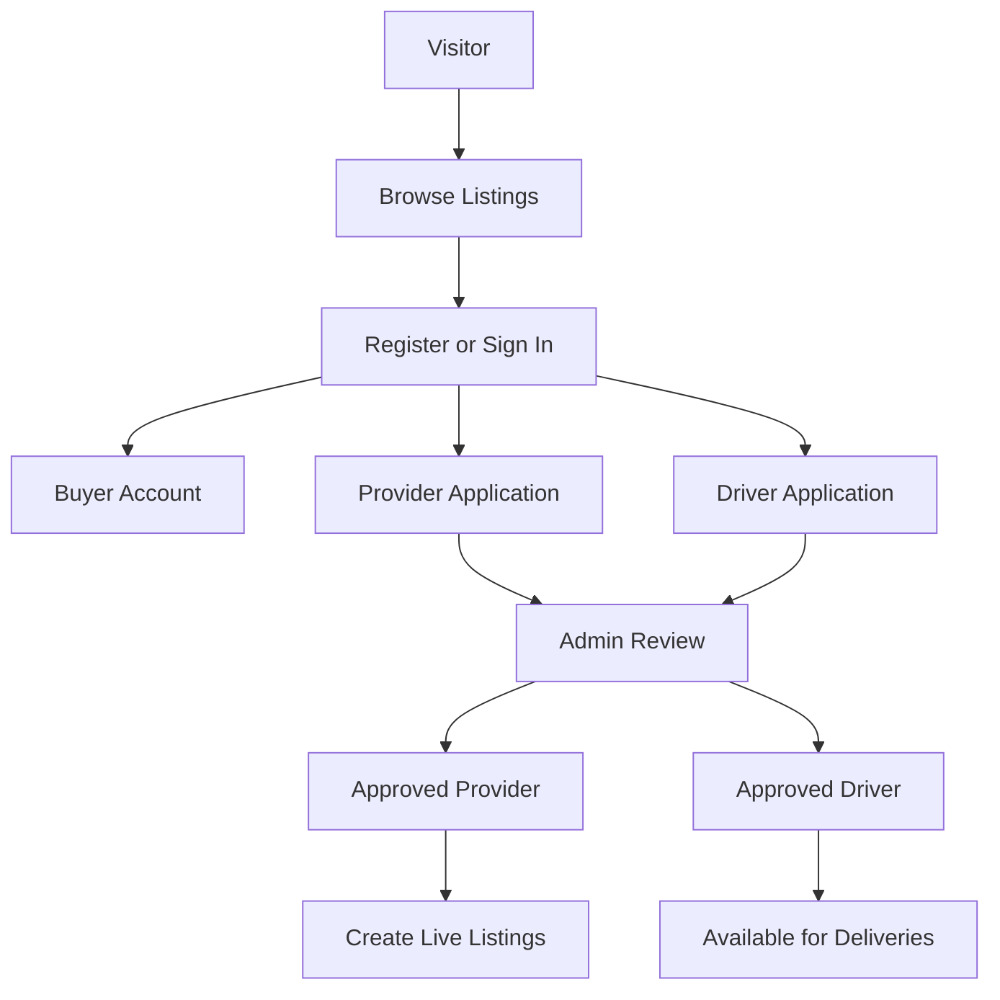
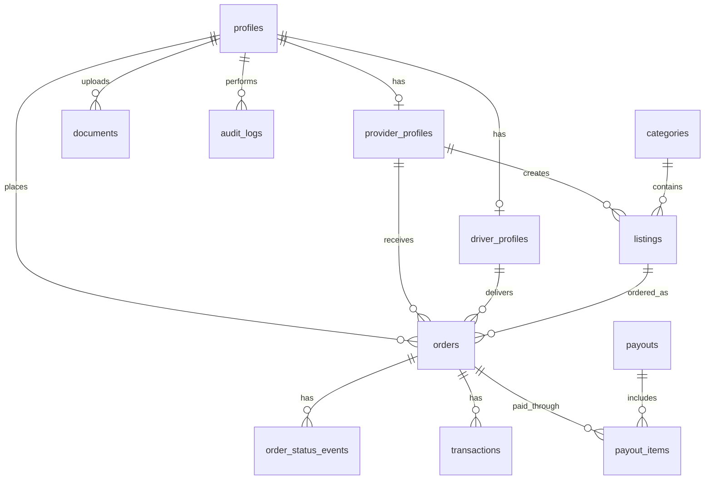

# Thumeka Architecture

## 1. Architecture Summary

Thumeka is a mobile-first marketplace built with:

- Next.js
- TypeScript
- Tailwind CSS
- Supabase Auth
- Supabase Postgres
- Supabase Storage
- Supabase Row Level Security
- Email service
- Google Maps links / optional distance calculation
- Hosted on mercury.hkdns.host

The application should not depend on Vercel-specific features.

---

## 2. High-Level Architecture



---

## 3. Runtime Responsibilities

### Next.js App

Responsible for:

- Mobile-first UI.
- Public marketplace pages.
- Buyer checkout.
- Provider dashboard.
- Driver dashboard.
- Admin dashboard.
- Server actions / route handlers.
- Role-based access enforcement.
- Calling Supabase.
- Sending emails.
- Creating WhatsApp links.
- Creating Google Maps links.

### Supabase Auth

Responsible for:

- Email/password authentication.
- User sessions.
- Auth user IDs.

### Supabase Postgres

Responsible for:

- Profiles.
- Provider profiles.
- Driver profiles.
- Listings.
- Orders.
- Transactions.
- Payouts.
- Audit logs.
- Admin settings.

### Supabase Storage

Use two buckets:

```txt
public-listing-images
private-documents
```

`public-listing-images`:

- Public read.
- Providers upload listing images.

`private-documents`:

- Private bucket.
- Stores provider/driver documents.
- Admin views via signed URLs.
- Documents must never be public.

### Email Service

Responsible for operational notifications.

Can use SMTP, Resend, SendGrid, or another provider.

### Google Maps

MVP usage:

- Generate external directions links.
- Optionally calculate distance if API key is configured.

Do not build live GPS tracking in MVP.

---

## 4. User Role Flow



---

## 5. Main App Routes

### Public

```txt
/
 /listings
 /listings/[id]
 /auth/sign-in
 /auth/register
 /support
```

### Buyer

```txt
/checkout/[listingId]
/buyer/orders
/buyer/orders/[id]
```

### Provider

```txt
/provider/apply
/provider/status
/provider/dashboard
/provider/listings
/provider/listings/new
/provider/listings/[id]/edit
/provider/orders
/provider/orders/[id]
/provider/earnings
/provider/payouts
```

### Driver

```txt
/driver/apply
/driver/status
/driver/dashboard
/driver/deliveries
/driver/deliveries/[id]
/driver/earnings
/driver/payouts
```

### Admin

```txt
/admin/dashboard
/admin/providers
/admin/providers/[id]
/admin/drivers
/admin/drivers/[id]
/admin/listings
/admin/orders
/admin/orders/[id]
/admin/payouts
/admin/transactions
/admin/audit-logs
/admin/settings
```

---

## 6. Access Control

Use both:

- server-side role checks,
- Supabase Row Level Security where practical.

Minimum access rules:

- Public users can read active public listings only.
- Buyers can read their own orders.
- Providers can read/update their own profile, listings, and received orders.
- Drivers can read/update assigned deliveries.
- Admin can read/update all operational data.
- Private documents are not publicly readable.

---

## 7. Data Relationship Diagram



---

## 8. Hosting Model

Thumeka will be hosted on:

```txt
mercury.hkdns.host
```

Recommended deployment model:

1. Build the Next.js app.
2. Run it as a Node.js app.
3. Use PM2 if SSH access is available.
4. Use HTTPS through the host/reverse proxy.
5. Store secrets in environment variables.
6. Keep Supabase managed externally.

Do not hard-code deployment URLs.

Use:

```txt
NEXT_PUBLIC_APP_URL
```

---

## 9. Required Environment Variables

```txt
NEXT_PUBLIC_SUPABASE_URL=
NEXT_PUBLIC_SUPABASE_ANON_KEY=
SUPABASE_SERVICE_ROLE_KEY=
NEXT_PUBLIC_APP_URL=
NEXT_PUBLIC_SUPPORT_WHATSAPP_NUMBER=
EMAIL_FROM=
EMAIL_SERVER_HOST=
EMAIL_SERVER_PORT=
EMAIL_SERVER_USER=
EMAIL_SERVER_PASSWORD=
GOOGLE_MAPS_API_KEY=
```

---

## 10. Implementation Priorities

Build in this order:

1. Supabase schema.
2. Auth and profile creation.
3. Role-based routing.
4. Provider onboarding.
5. Driver onboarding.
6. Listings.
7. Buyer checkout and order request.
8. Provider order acceptance.
9. EFT instructions and admin payment confirmation.
10. Driver assignment and delivery status.
11. Transactions, payouts, and audit logs.
12. Email notifications.
13. Deployment to mercury.hkdns.host.
