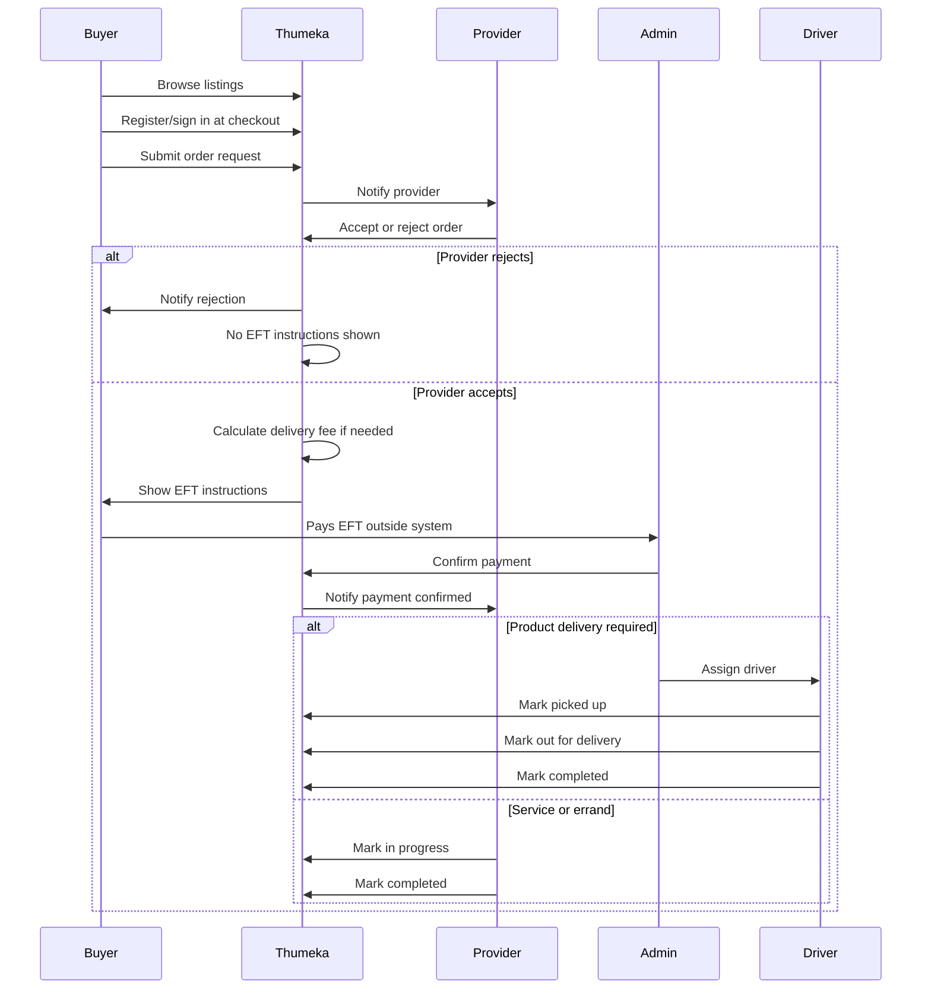
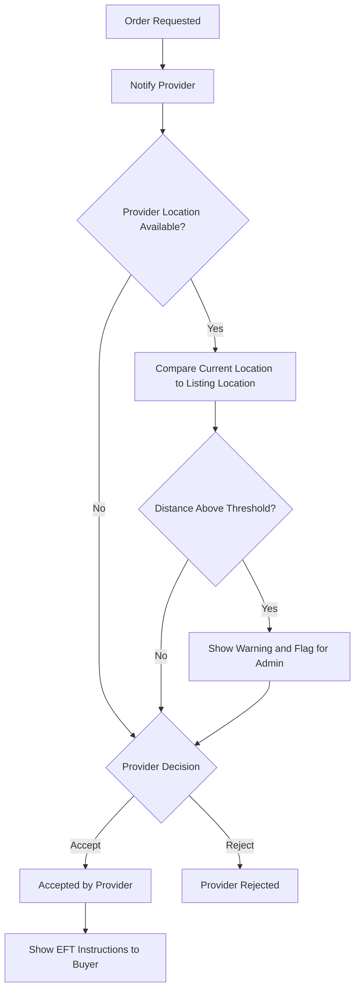
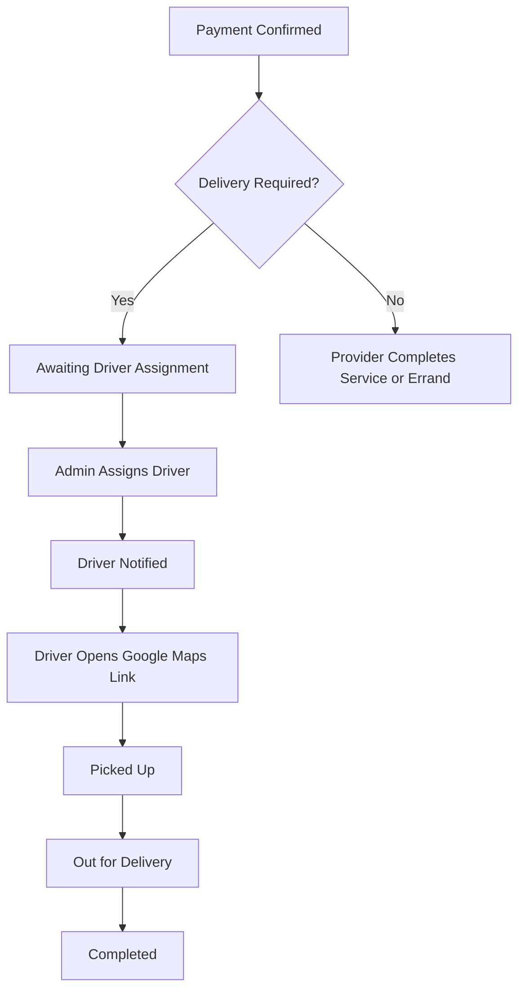
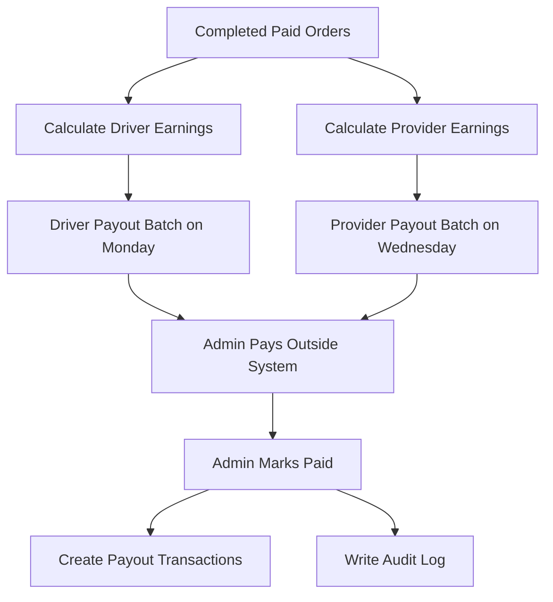

# Thumeka Order Flow

## 1. Core Rule

A buyer must not receive EFT payment instructions until the provider has accepted the order.

This protects buyers from paying for unavailable products, services, or errands.

---

## 2. Full Order Lifecycle

Recommended order statuses:

```txt
order_requested
awaiting_provider_acceptance
provider_rejected
provider_location_warning
accepted_by_provider
delivery_fee_calculated
awaiting_buyer_eft
eft_submitted
payment_confirmed
preparing_or_scheduled
awaiting_driver_assignment
driver_assigned
picked_up
out_for_delivery
service_in_progress
completed
cancelled
issue_reported
```

---

## 3. Buyer Order Request Flow



---

## 4. Order Status Details

### `order_requested`

Buyer submits an order request from checkout.

No payment instructions shown yet.

### `awaiting_provider_acceptance`

Provider must accept or reject.

### `provider_rejected`

Provider cannot fulfill.

Buyer should be notified.

No payment required.

### `provider_location_warning`

Optional status/flag if provider location is too far from the listing fulfillment location.

Do not auto-cancel.

### `accepted_by_provider`

Provider confirms they can fulfill the order.

### `delivery_fee_calculated`

System calculates:

```txt
delivery_fee = base_delivery_fee + (distance_km * price_per_km)
```

Default base delivery fee:

```txt
R36
```

Admin can override.

### `awaiting_buyer_eft`

Buyer sees EFT instructions and total amount.

### `eft_submitted`

Optional status if the buyer submits reference/proof.

Can be skipped in MVP if admin confirms from bank statement.

### `payment_confirmed`

Admin confirms EFT manually.

Create transactions:

- `buyer_eft_confirmed`
- `platform_commission`
- `provider_earning`
- `driver_earning` if driver earning is already known

### `preparing_or_scheduled`

Provider prepares product or schedules service/errand.

### `awaiting_driver_assignment`

Product order needs delivery.

### `driver_assigned`

Admin assigns approved available driver.

### `picked_up`

Driver collected product.

### `out_for_delivery`

Driver is delivering.

### `service_in_progress`

Service or errand is being performed.

### `completed`

Product delivered or service completed.

Completed orders become eligible for payout.

### `cancelled`

Order cancelled.

Admin should record reason.

### `issue_reported`

Issue raised. Support handled through WhatsApp.

---

## 5. Provider Acceptance With Location Guardrail



Implementation rules:

- Ask for browser location only during provider acceptance.
- If denied or unavailable, continue without blocking.
- Compare provider current location to listing fulfillment coordinates if available.
- If distance exceeds threshold, show warning.
- Suggested default threshold: 3 km.
- Suggested fast acceptance window: 5 minutes.
- Do not automatically cancel because GPS may be inaccurate.

---

## 6. Delivery Assignment Flow



Driver assignment rules:

- Only approved drivers can be assigned.
- Driver should preferably be available.
- Admin can override if necessary.
- Assigned driver can view buyer delivery address and provider pickup location.
- Driver sees Google Maps link.
- Driver cannot see private provider documents or buyer account details beyond delivery contact details.

---

## 7. Delivery Fee Calculation

Inputs:

- `base_delivery_fee`
- `distance_km`
- `price_per_km`

Formula:

```txt
delivery_fee = base_delivery_fee + (distance_km * price_per_km)
```

Default base delivery fee:

```txt
36.00
```

Admin settings:

- base delivery fee,
- price per km,
- manual override allowed.

If distance cannot be calculated:

- admin enters distance manually, or
- admin enters final delivery fee manually.

---

## 8. Financial Calculation Flow

When provider accepts and delivery fee is known:

```txt
buyer_total = listing_price + delivery_fee
commission_amount = listing_price * commission_percentage / 100
provider_earning = listing_price - commission_amount
driver_earning = delivery_fee or admin-set driver amount
```

Default commission:

```txt
12%
```

Important:

- Store commission percentage on each order.
- Store delivery fee details on each order.
- Do not recalculate old orders if admin later changes commission/rates.

---

## 9. Payout Flow



Driver payout day:

```txt
Monday
```

Provider payout day:

```txt
Wednesday
```

Payout eligibility:

- order is `completed`,
- payment status is `confirmed`,
- order not already included in a paid payout.

---

## 10. WhatsApp Support

Use WhatsApp support link for:

- disputes,
- refunds,
- buyer issues,
- provider issues,
- driver issues.

Example URL format:

```txt
https://wa.me/{SUPPORT_NUMBER}?text={ENCODED_MESSAGE}
```

The support number must be set by admin or through:

```txt
NEXT_PUBLIC_SUPPORT_WHATSAPP_NUMBER
```
